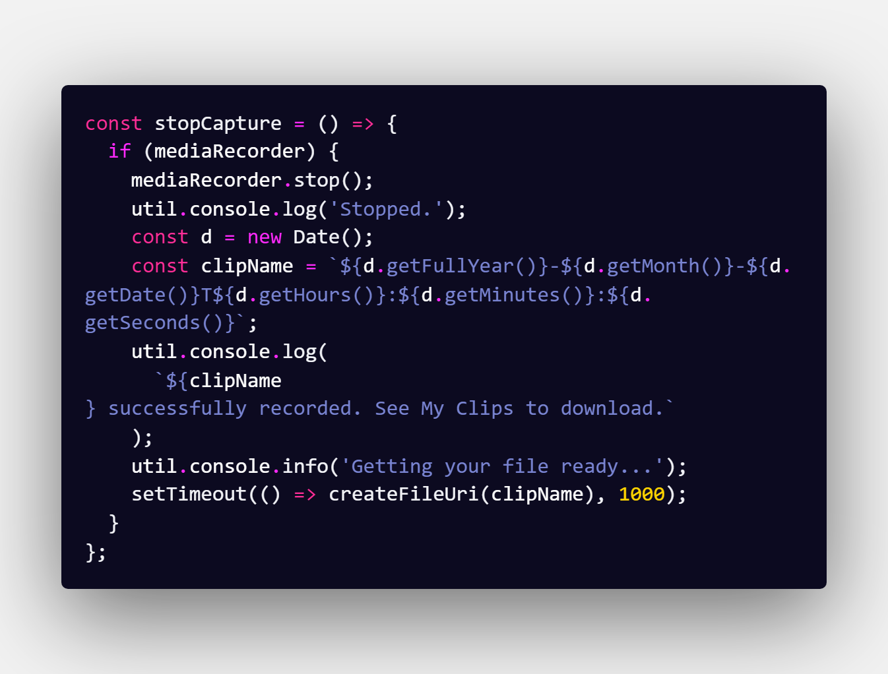

# ScreenieBaby

A simple web application for capturing and saving your screen as a webm video. Makes use of the [W3C MediaStream Recording API specification](https://w3c.github.io/mediacapture-record/#MediaRecorderAPI).

The application is entirely client-side. It does not transmit your screen to anywhere, it does not store your data anywhere. Aside from downloading the source files from github.io, the magic happens in your own browser. I don't want your data. Keep it.

## Browser Compatability

- All of the MediaStream Recording specifications used in this project are fully supported in the most common modern browsers.

  - Chrome 49+
  - Firefox 25+
  - No IE support
  - No Edge support

- For a full list of specification compatability, see [browser compatability](https://developer.mozilla.org/en-US/docs/Web/API/MediaRecorder#Browser_compatibility).

## Installation

- No installation required!
- Just download the vanilla HTML, CSS, and JavaScript files, and run them in a modern browser.
- Not compatible with Internet Explorer. Will never be compatible with Internet Explorer.

## Usage

### Setting video quality

- This uses the webm, vp9 codecs.
- You can control the `videoBitsPerSecond` setting by using the Video Quality drop-down at the top of the page.
  - Note: I don't actually know much about video encoding. So, the labels are probably not _technically_ correct. But whatever. I was mostly just setting the bar low to alleviate fears at my organization of filesize bloat.
- Currently, here are the corresponding videoBitsPerSecond for each option.
  - Low: 150000
  - Medium: 500000
  - High 1000000
  - Super High: 2500000
- Here's a quick, not scientific, video size comparison for a 30 second video:
  - Low: 1.070 MB
  - Super High: 3.750 MB

### Recording video

- To record video, just press the round button at the top of the page.  
  
- Your browser should prompt you to allow screen recording.
- In the prompt, you can select the screen or application you want to record.
- The `<video>` element will show the capture as it records. The record button will also display a little red light when it's recording.
- When you're done recording, press the round button again. The browser will process, then drop your file in the My Clips section.
  - Most of this is _not_ asynchronous at this time, so right now it just pauses for a second while it loads the stream track into the video tracks library. I didn't benchmark on multiple devices, so if it doesn't work from you, I'm sorry about it.
- Note: In Chrome, a little bar appears on your screen that tells you it's recording. If you press "Stop Sharing", you'll also need to hit the Record button on the app again, as this button controls when things populate to the downloads section.

### Downloading video

- Once your clip appears in the My Clips section, click it and it'll download. I mean, that's really it.
  

## Development Roadmap

- Rewrite in TypeScript and Sass.
- Rewrite record/stop/download as asynchronous processes so that I can avoid that ugly setTimeout callback. Bad Noel! Bad job!
  
  _God, isn't it hideous?_
- Remove all of the util.console stuff. It was a fun idea to play with, but there are better ways to communicate with users.
- Add Jest so that I don't have to manually test everything.
- Make a "super serious" mode, so that when your boss comes around, you can click a button to make it all professional looking. I don't necessarily _want_ you to get in trouble for having a bright pink "Screenie Baby" application in your browser window. My coworkers already know I've got issues, but yours might not.

## Known Limitations

- The application doesn't provide any on-screen feedback when things go wrong. Hit F12 and you can see when errors occur.
  - Typical errors are caused by the non-asynchronous nature of the code and rejecting the screen capture prompt.
- It doesn't currently work on mobile. That wasn't the use case for it, so I didn't write it to work there. If it becomes interesting or necessary, maybe I'll take a look. Not planning on it, though.
